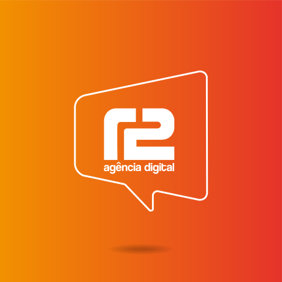
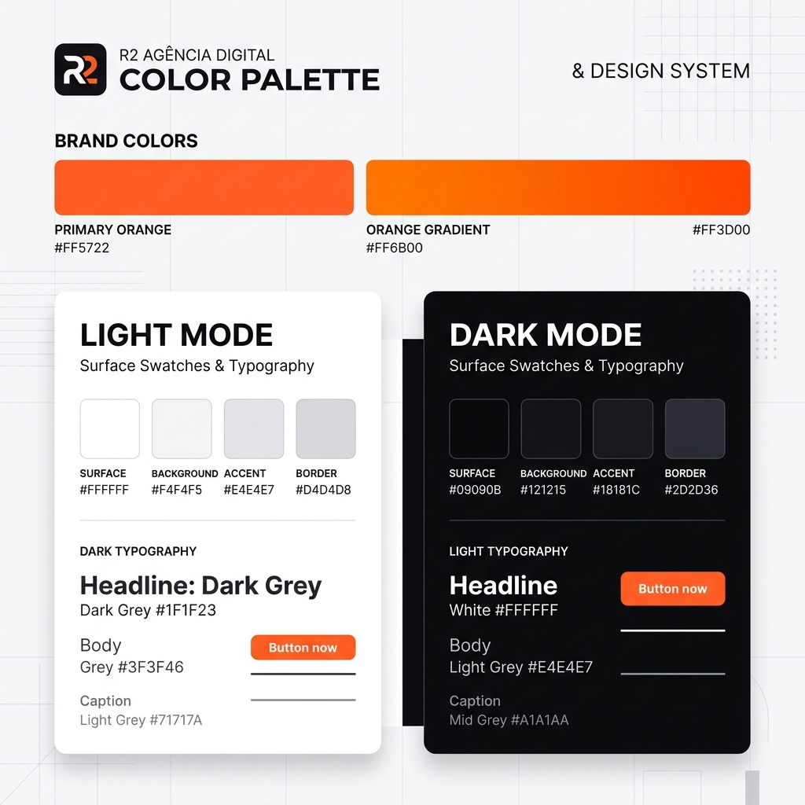

<div align="center">

# R2 Digital Design System 🎨⚡



</div>

Sistema de Design e biblioteca de componentes React de alta performance oficial da **R2 Agência Digital**. Desenvolvido em estrutura de monorepo moderna, focado em acessibilidade nativa, tipagem estrita em TypeScript e identidade visual marcante — com suporte nativo a **Dark Theme** e **Light Theme**.

> **Peer dependencies:** `react >= 18`, `react-dom >= 18`, `typescript >= 5.0`

---

## 📦 Pacotes do Monorepo

| Pacote | Versão | Descrição |
| :--- | :--- | :--- |
| **`@r2digital/design-system`** | `v1.0.0` | Pacote principal de entrada (re-exporta componentes e tokens). |
| **`@r2digital/tokens`** | `v1.0.0` | Tokens de design: paleta de cores oficial, tipografia, espaçamentos e variáveis CSS. |
| **`@r2digital/ui`** | `v1.0.0` | Biblioteca de componentes React acessíveis (`Button`, `Badge`, `Callout`, `Card`). |

---

## ⚡ Instalação & Uso Rápido

Instale o pacote principal no seu projeto React/Next.js:

```bash
npm install @r2digital/design-system
# ou usando pnpm / yarn:
pnpm add @r2digital/design-system
```

### Importação Global de Estilos

Importe os temas e variáveis CSS no ponto de entrada global da sua aplicação (ex: `app/layout.tsx` ou `src/main.tsx`):

```tsx
import "@r2digital/tokens/theme.css";
import "@r2digital/ui/styles.css";
```

### Exemplo de Uso de Componente (React + TypeScript)

```tsx
import React from "react";
import { Button, Badge, Card, Callout } from "@r2digital/design-system";

export function AgencyDashboard() {
  return (
    <Card hoverable className="max-w-md">
      <div className="flex items-center justify-between mb-4">
        <Badge variant="brand">Projeto Ativo</Badge>
        <span className="text-sm text-neutral-400">R2 Digital Engine</span>
      </div>

      <h3 className="text-xl font-bold mb-2">Plataforma de Performance</h3>
      <p className="text-neutral-400 mb-6">
        Interface integrada com tokens visuais e componentes desacoplados de alta performance.
      </p>

      <Callout variant="brand" title="Aviso de Sistema" className="mb-6">
        Design tokens sincronizados com a nova identidade visual.
      </Callout>

      <div className="flex gap-3">
        <Button variant="primary" size="md">
          Acessar Painel
        </Button>
        <Button variant="outline" size="md">
          Documentação
        </Button>
      </div>
    </Card>
  );
}
```

---

## 🎨 Paleta de Cores Oficial (R2 Brand Palette)



### Cores da Marca & Dark Theme

| Amostra | Token | Hex | Aplicação |
| :---: | :--- | :--- | :--- |
|  | **`brand.500`** | `#FF5722` | Cor primária da marca R2 Agência Digital |
|  | **`brand.600`** | `#FF3D00` | Cor de destaque / Hover vibrante |
|  | **`brand.gradient`** | `linear-gradient(135deg, #FF6B00 0%, #FF3D00 100%)` | Gradiente oficial em botões primários e glows |
|  | **`dark.950`** | `#09090B` | Fundo principal da aplicação (Dark Theme) |
|  | **`dark.900`** | `#121215` | Superfícies elevadas e painéis de controle |
|  | **`dark.850`** | `#18181C` | Cards e containers visuais |
|  | **`dark.700`** | `#2D2D36` | Bordas e divisores de conteúdo |

### Escala Light Theme (Fundo Claro)

| Amostra | Token | Hex | Aplicação |
| :---: | :--- | :--- | :--- |
|  | **`light.50`** | `#FFFFFF` | Fundo claro principal da aplicação |
|  | **`light.100`** | `#F4F4F5` | Superfícies elevadas e painéis (Light Theme) |
|  | **`light.200`** | `#E4E4E7` | Cards e containers em fundo claro |
|  | **`light.300`** | `#D4D4D8` | Bordas e divisores em fundo claro |
|  | **`light.900`** | `#18181B` | Texto principal em fundo claro |

---

## 🚀 Scripts do Monorepo

```bash
# Iniciar ambiente de desenvolvimento / Storybook
npm run storybook

# Buildar todos os pacotes do monorepo
npm run build

# Executar checagem de tipos em TypeScript
npm run typecheck

# Executar suíte de testes unitários
npm run test
```

---

## 📄 Documentação Técnica & Links

- 🗺️ **Roadmap Público:** [`docs/roadmap-publico.md`](docs/roadmap-publico.md)
- 🤝 **Guia de Contribuição:** [`docs/como-contribuir.md`](docs/como-contribuir.md)
- 🔒 **Diretrizes de Segurança:** [`docs/seguranca.md`](docs/seguranca.md)
- 📐 **Regras de Arquitetura:** [`.cursor/rules/como-trabalhar.mdc`](.cursor/rules/como-trabalhar.mdc)

---

## 📄 Licença

Distribuído sob a licença MIT. Direitos reservados à **R2 Agência Digital Engine Team**.
